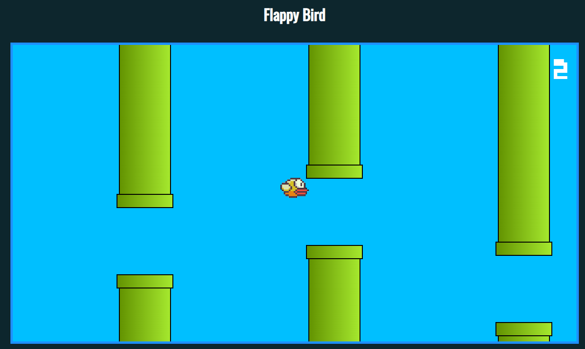

## Projeto Flappy Bird desenvolvido para estudos entre integração entre HTML, CSS e Javascript.  

Flappy Bird é um jogo eletrônico que consiste em ultrapassar as barreiras (os canos superiores e inferiores) sem encostar neles e acumular pontos.

Aperte ou pressione a tecla espaço para o pássaro ir para cima e solte para ir para baixo.

Para recomeçar, atualize a página (F5).

_________________________________________________________________________

